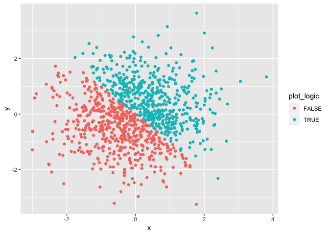

p8105\_hw1\_gsl2116
================
Grace Liu
9/21/2018

Problem 1
---------

Create a data frame comprised of:
+ A random sample of size 10 from a uniform\[0, 5\] distribution
+ A logical vector indicating whether elements of the sample are greater than 2
+ A (length-10) character vector
+ A (length-10) factor vector

``` r
set.seed(1)
set_a = tibble(
  sample_runif = runif(10, min = 0, max = 5),
  vec_logic = sample_runif > 2,
  vec_char = c("a", "b", "c", "d", "e", "f", "g", "h", "i", "j"),
  vec_factor = factor(vec_char)
 )
```

#### Calculate means for all variables:

``` r
mean(set_a$sample_runif)
```

    ## [1] 2.757569

``` r
mean(set_a$vec_logic)
```

    ## [1] 0.6

``` r
mean(set_a$vec_char)
```

    ## Warning in mean.default(set_a$vec_char): argument is not numeric or
    ## logical: returning NA

    ## [1] NA

``` r
mean(set_a$vec_factor)
```

    ## Warning in mean.default(set_a$vec_factor): argument is not numeric or
    ## logical: returning NA

    ## [1] NA

Means were not able to be calculated for the character and factor variables, as they are not numeric or logical variables. Means can be calculated for logical variables as TRUE and FALSE are assigned values of 1 and 0.

#### Explicitly converting variables to numeric:

``` r
as.numeric(set_a$vec_logic)
as.numeric(set_a$vec_char)
```

    ## Warning: NAs introduced by coercion

``` r
as.numeric(set_a$vec_factor)
```

#### Convert character variable from character to factor to numeric:

``` r
as.numeric(as.factor(set_a$vec_char))
```

#### Convert factor variable from factor to character to numeric:

``` r
as.numeric(as.character(set_a$vec_factor))
```

    ## Warning: NAs introduced by coercion

Problem 2
---------

Create a data frame comprised of:
+ x: a random sample of size 1000 from a standard Normal distribution
+ y: a random sample of size 1000 from a standard Normal distribution
+ A logical vector indicating whether the x + y &gt; 0
+ A numeric vector created by coercing the above logical vector
+ A factor vector created by coercing the above logical vector

``` r
set.seed(1)
plot_data = tibble(
  x = rnorm(1000),
  y = rnorm(1000),
  plot_logic = x + y > 0,
  plot_factor = as.factor(plot_logic)
)
```

This dataset has 1000 rows and 4 columns. The mean of x is -0.0116481, and the median of x is -0.0353242. The proportion of cases for which the logical vector is TRUE is 0.49.

#### Scatterplot of x and y

``` r
ggplot(plot_data, aes(x = x, y = y, color = plot_logic)) + geom_point()
```


